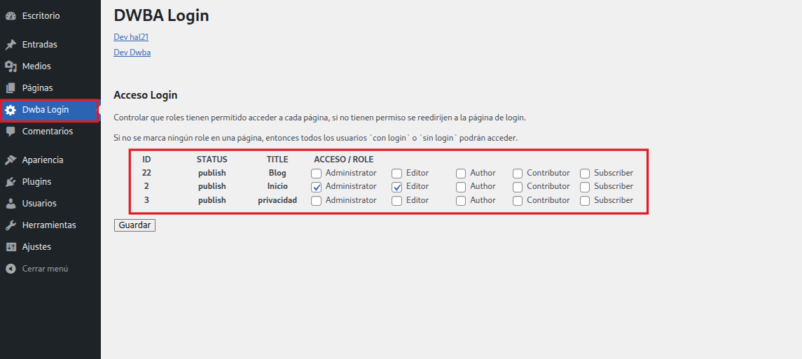
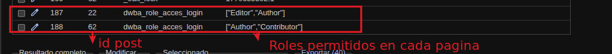

# PLUGIN DWBA LOGIN WordPress
Este plugin ofrece funcionalidades útiles para el login y reedirecciones en wordpress.
https://dwba.es/

## Características 1.0.1
WordPress:   6.9 | 6.9.1  
PHP:      8.0.30 | 8.1.29 | 8.2.27 | 8.3.23 | 8.4.10 | 

### Configuración de acceso a páginas por roles.
Controla el acceso a una o varias páginas según el role del usuario o dejala publica.  
Si una página esta configurada con acceso a login por un role o roles y el usuario no está logueado o su usuario no tiene ese role se redirecciona a login.

Se ignora la página de entradas.

#### Información técnica

##### Acceso  por Roles

Si la página tiene el campo `dwba_role_acces_login` significa que tiene control de acceso configurado, si no existe entonces es una pagina publica sin ninguna redirección.  

El campo `dwba_role_acces_login` tiene como valor un array en texto con los roles que si tienen acceso por cada pagina configurada. El campo se almacena en la tabla wp_postmeta.  

Se compruba si la página tiene acceso restrijido y se compara con los roles del usuario.

